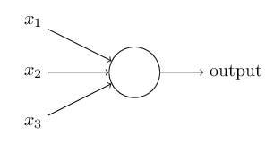
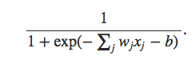
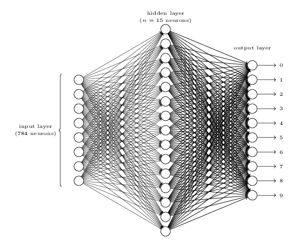
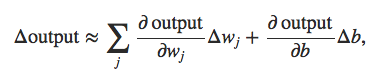
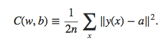
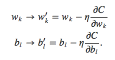

# Digit-Recognition

## Overview
In this project we train neural network to identify the digits from the [MNIST data set](https://en.wikipedia.org/wiki/MNIST_database). It is a simple feed forward neural network with back propogation. The dataset can be obtained in the IDX file format for MNIST digits from http://yann.lecun.com/exdb/mnist/ 

## Principles Used 
Here a feed forward neural network has been implemented. At the heart of every neural network are small units called perceptrons. The following displays a perceptron unit. 

Each of the input to the perceptron is associated with a weight w and every perceptron has an associated bias b with it. The net output for a perceptron with sigmoid activation function is given by 

A combination of such perceptrons forms a layer. Here we use three such layers, the input layer, the hidden layer and the output layer. A simple architecture is shown below. The input layer in our case consists of 784 neurons, the hidden layer 150 and the ouptut layer 10. 

Neural Networks work on the principle that a small change in the weight of the input to a single perceptron and the bias b produces a small change in the ouptut which is given by the relation. 

To update the weigts we calculate the cost function for the network. It is given by : 

Here y(x) is the predicted ouput from our network for an input x and a is the actual label for the input, while n is the total number of training inputs. Further the [Gradient Descent Algorithm](https://en.wikipedia.org/wiki/Gradient_descent) was used to write the updation rule for weights and biases. [Cross Validation](https://en.wikipedia.org/wiki/Cross-validation_(statistics)) is used to improve the accuracy of the model on the testing set. The updation rule is given by  

## Usage 
Download the mnist data set from http://yann.lecun.com/exdb/mnist/ and keep all the files in the same directory.  
In the command line run as `python main.py`

## Acknowledgement
I would like to sincerely thank the [article](http://neuralnetworksanddeeplearning.com/chap1.html) by [Michael Nielson](http://michaelnielsen.org) for a brief explanation of the basics of the neural networks. 

## Author:  
[Vipul Khatana](https://github.com/vipul-khatana) 

Course Project under [**Prof. Jayadeva**](http://ee.iitd.ernet.in/people/jayadeva.html) 
